# 포트폴리오 웹사이트

프론트엔드 개발자 포트폴리오 웹사이트입니다. Next.js 15와 TypeScript를 기반으로 구축되었으며, 커스텀 UI 컴포넌트 시스템과 Storybook을 활용한 컴포넌트 문서화를 포함합니다.

> **🌐 라이브 데모**: [https://text-indent9999px.vercel.app](https://text-indent9999px.vercel.app)  
> **📚 Storybook**: [https://text-indent9999px-storybook.vercel.app](https://text-indent9999px-storybook.vercel.app)

## 📋 목차

- [기술 스택](#-기술-스택)
- [프로젝트 구조](#-프로젝트-구조)
- [시작하기](#-시작하기)
- [주요 기능](#-주요-기능)
- [프로젝트 구조 상세](#-프로젝트-구조-상세)
- [스크립트](#-스크립트)
- [환경 변수](#-환경-변수)
- [배포](#-배포)
- [테스트](#-테스트)
- [성능 최적화](#-성능-최적화)
- [접근성](#-접근성)
- [개발 가이드](#-개발-가이드)
- [트러블슈팅](#-트러블슈팅)
- [아키텍처 결정](#-아키텍처-결정)

## 🛠 기술 스택

### Core

- **Next.js** 15.4.2 (App Router)
- **React** ^0.0.0-experimental-6de32a5a-20250822
- **TypeScript** ^5.x
- **Node.js** 18.x 이상 (권장: 20.x)

### 스타일링

- **Tailwind CSS** 4.1.11
- **SCSS Modules** (SASS 1.89.2)
- **CSS Custom Properties** (디자인 토큰)
- **PostCSS** 8.5.6 (Autoprefixer 포함)

### 개발 도구

- **Storybook** 9.1.10 (컴포넌트 문서화 및 시각적 테스트)
  - Chromatic addon (시각적 회귀 테스트)
- **ESLint** 9 (코드 품질 관리)
- **Stylelint** 16.22.0 (스타일 품질 관리)

### 라이브러리

- **Shiki** 3.15.0 (코드 하이라이팅)
- **FontAwesome** 7.0.0 (아이콘)

### 기능

- **View Transition API** (페이지 전환 애니메이션)
- **다크모드** 지원 (시스템 설정 자동 감지 + 수동 전환)
- **커스텀 커서** 효과 (인터랙티브 UI)

## 📁 프로젝트 구조

```
src/
├── app/                    # Next.js App Router
│   ├── api/               # API 라우트
│   │   └── code/          # 코드 하이라이팅 API
│   ├── contact/           # 연락처 페이지
│   ├── profile/           # 프로필 페이지
│   ├── projects/         # 프로젝트 페이지
│   │   └── [id]/         # 프로젝트 상세 페이지
│   ├── layout.tsx         # 루트 레이아웃
│   ├── page.tsx          # 홈 페이지
│   ├── not-found.tsx     # 404 페이지
│   └── globals.css       # 전역 스타일
├── assets/               # 정적 자산
│   └── images/           # 이미지 파일
├── components/           # React 컴포넌트
│   ├── common/           # 공통 컴포넌트 (Logo, Navigation)
│   ├── effects/          # 효과 컴포넌트 (CustomCursor)
│   ├── layout/           # 레이아웃 컴포넌트
│   ├── pages/            # 페이지 컴포넌트
│   ├── providers/        # Context Providers
│   ├── styleGuide/       # 스타일 가이드 컴포넌트
│   └── ui/               # UI 컴포넌트 (Button, Card, Badge 등)
├── config/               # 설정 파일
│   └── links.ts          # 외부 링크 설정
├── contexts/             # React Context
├── data/                 # 정적 데이터
│   ├── profile/          # 프로필 데이터
│   └── projects/        # 프로젝트 데이터
├── hooks/                # Custom Hooks
├── styles/               # 전역 스타일 파일
│   ├── colors.css        # 색상 시스템
│   ├── design-tokens.css # 디자인 토큰
│   ├── elevation.css     # 그림자 시스템
│   └── view-transition.css # View Transition 스타일
├── types/                # TypeScript 타입 정의
└── utils/                # 유틸리티 함수
```

## 🚀 시작하기

### 필수 요구사항

- **Node.js** 18.x 이상 (권장: 20.x LTS)
- **npm** 9.x 이상 또는 **yarn** 1.22.x 이상
- **Git** (선택사항)

### 설치

```bash
# 저장소 클론
git clone https://github.com/text-indent9999px/portfolio2025.git
cd portfolio

# 의존성 설치
npm install
```

### 개발 서버 실행

```bash
# 개발 서버 시작
npm run dev
```

브라우저에서 [http://localhost:3000](http://localhost:3000)을 열어 확인하세요.

### Storybook 실행

```bash
# Storybook 개발 서버 시작
npm run storybook
```

브라우저에서 [http://localhost:6006](http://localhost:6006)을 열어 확인하세요.

## ✨ 주요 기능

### 1. UI 컴포넌트 시스템

- **디자인 토큰 기반 스타일링**: CSS Custom Properties와 Tailwind를 활용한 중앙 집중식 디자인 시스템
- **Compound 패턴**: 확장 가능하고 유연한 컴포넌트 구조 (예: `Card.Header`, `Card.Body`, `Card.Footer`)
- **Storybook 통합**: 모든 UI 컴포넌트에 대한 문서화 및 시각적 테스트
- **타입 안정성**: TypeScript를 통한 완전한 타입 지원
- **재사용 가능한 미디어 컴포넌트**: `Image`, `Video` 컴포넌트를 통한 일관된 미디어 표시 및 접근성 지원

### 2. 다크모드 지원

- **시스템 설정 자동 감지**: `prefers-color-scheme` 미디어 쿼리를 통한 자동 테마 적용
- **수동 테마 전환**: 사용자가 직접 라이트/다크 모드 전환 가능
- **CSS Custom Properties**: 테마 전환 시 리렌더링 최소화
- **localStorage 기반 영속성**: 사용자 선택 테마 저장

### 3. 페이지 전환 애니메이션

- **View Transition API**: 네이티브 브라우저 API를 활용한 부드러운 페이지 전환
- **커스텀 전환 효과**: 페이지별 맞춤형 전환 애니메이션
- **성능 최적화**: GPU 가속을 활용한 60fps 애니메이션

### 4. 커스텀 커서

- **인터랙티브 커서 효과**: 마우스 움직임에 반응하는 커스텀 커서
- **호버 상태 감지**: 버튼, 링크 등 인터랙티브 요소에 따른 커서 변화
- **성능 최적화**: `requestAnimationFrame`을 활용한 부드러운 애니메이션

### 5. 반응형 디자인

- **모바일 퍼스트**: 모바일, 태블릿, 데스크톱 지원
- **Tailwind CSS**: 유틸리티 클래스를 활용한 반응형 레이아웃
- **접근성 고려**: 터치 디바이스와 키보드 네비게이션 지원
- **데이터 절약**: 모바일/태블릿 환경에서 비디오 지연 로딩으로 데이터 사용량 최적화

### 6. 프로젝트 스크린샷

#### 데스크톱

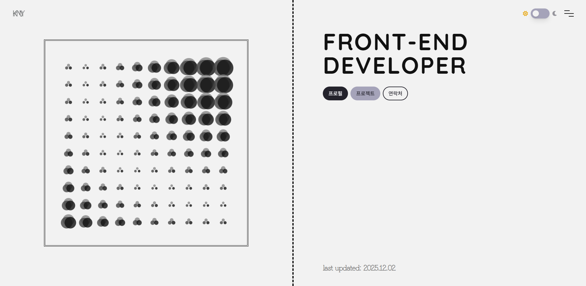
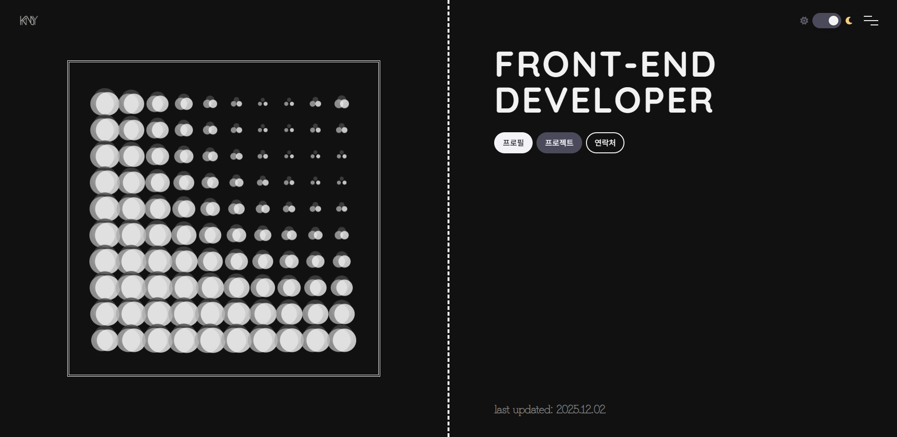

#### 태블릿

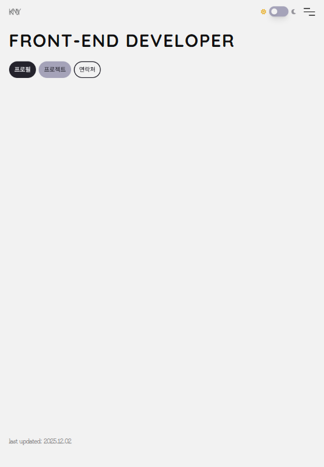
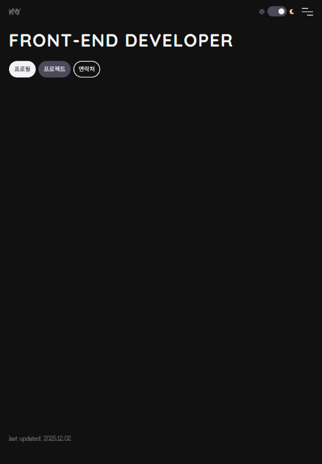

#### 모바일

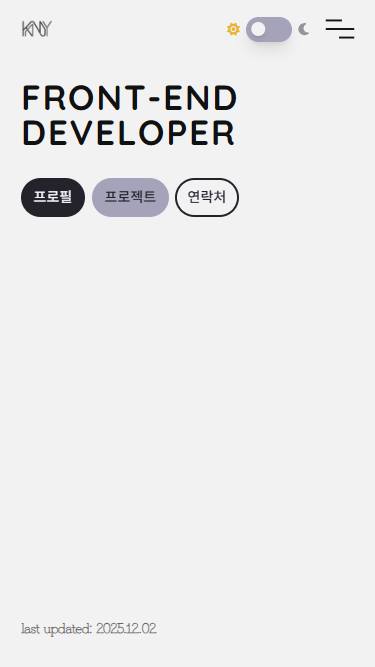
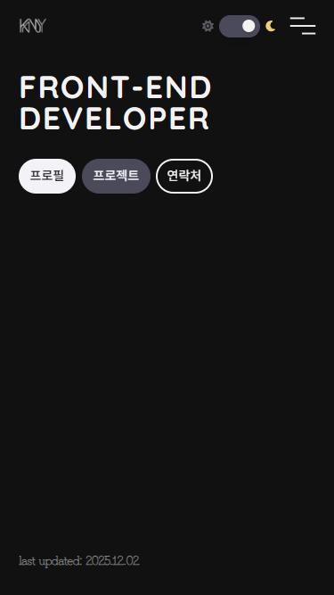

#### Storybook

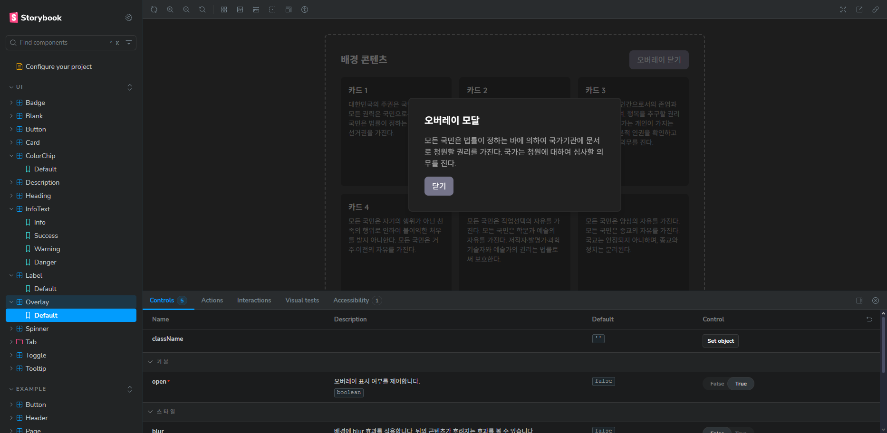

## 📂 프로젝트 구조 상세

### App Router 구조 (`src/app/`)

```
app/
├── api/
│   └── code/
│       └── [filename]/
│           └── route.ts      # 코드 하이라이팅 API 엔드포인트
│                              # GET /api/code/[filename] - 파일 내용 반환
├── contact/
│   └── page.tsx             # 연락처 페이지
├── profile/
│   └── page.tsx             # 프로필 페이지
├── projects/
│   ├── [id]/
│   │   └── page.tsx         # 프로젝트 상세 페이지 (동적 라우트)
│   └── page.tsx             # 프로젝트 목록 페이지
├── layout.tsx               # 루트 레이아웃 (폰트, 메타데이터 설정)
├── page.tsx                  # 홈 페이지
├── not-found.tsx             # 404 에러 페이지
└── globals.css               # 전역 CSS (Tailwind, 디자인 토큰 import)
```

### 주요 컴포넌트

- **UI 컴포넌트** (`src/components/ui/`): 재사용 가능한 UI 컴포넌트

  - `Button`: 5가지 variant (filled/tonal/outlined/ghost/text), 3가지 size
  - `Card`: Compound 패턴 (Header/Thumb/Body/Footer)
  - `Badge`: 숫자 카운트, 아이콘, 위치 조정 기능
  - `Tab`: Primary/Secondary 타입 지원
  - `Toggle`, `Tooltip`, `Overlay` 등
  - 각 컴포넌트는 Storybook 스토리 포함

- **페이지 컴포넌트** (`src/components/pages/`): 페이지별 컴포넌트

  - `Home`: 홈 페이지 메인 콘텐츠
  - `Profile`: 프로필 페이지 (소개, 스킬, 경력)
  - `Projects`: 프로젝트 목록 및 상세 페이지
  - `Contact`: 연락처 페이지

- **레이아웃 컴포넌트** (`src/components/layout/`): 레이아웃 컴포넌트
  - `CenteredLayout`: 중앙 정렬 레이아웃
  - `SplitLayout`: 분할 레이아웃

### 스타일 시스템

- **디자인 토큰** (`src/styles/design-tokens.css`): 공통 디자인 값 (색상, 간격, 타이포그래피 등)
- **색상 시스템** (`src/styles/colors.css`): 라이트/다크 모드 색상 정의
- **Elevation** (`src/styles/elevation.css`): Material Design 기반 그림자 시스템

## 📜 스크립트

```bash
# 개발 서버 실행
npm run dev

# 프로덕션 빌드
npm run build

# 프로덕션 서버 실행
npm start

# 린트 검사
npm run lint

# 스타일 린트 검사 및 자동 수정
npm run stylelint

# Storybook 개발 서버
npm run storybook

# Storybook 빌드
npm run build-storybook

# Storybook 빌드 + 프로젝트 빌드 (전체 빌드)
npm run build:all
```

## 🔧 환경 변수

프로젝트 루트에 `.env.local` 파일을 생성하여 환경 변수를 설정할 수 있습니다.

```env
# Storybook URL (선택사항)
# Vercel 배포 후 실제 스토리북 URL로 변경하세요
# 예: https://portfolio-storybook.vercel.app
NEXT_PUBLIC_STORYBOOK_URL=
```

> **주의**: 환경 변수를 변경한 후에는 개발 서버를 재시작해야 합니다.

### 환경 변수 보안

- `.env.local` 파일은 `.gitignore`에 포함되어 Git에 커밋되지 않습니다.
- `NEXT_PUBLIC_` 접두사가 붙은 변수만 클라이언트에서 접근 가능합니다.
- 민감한 정보는 절대 `NEXT_PUBLIC_` 접두사를 사용하지 마세요.

## 🚀 배포

### Vercel 배포 (권장)

1. **Vercel 계정 생성**: [vercel.com](https://vercel.com)에서 GitHub 계정으로 로그인
2. **프로젝트 연결**: GitHub 저장소를 Vercel에 연결
3. **빌드 설정**:
   - Framework Preset: Next.js
   - Build Command: `npm run build`
   - Output Directory: `.next`
4. **환경 변수 설정**: Vercel 대시보드에서 `NEXT_PUBLIC_STORYBOOK_URL` 추가
5. **배포**: 자동으로 배포가 시작됩니다

### 스토리북 별도 배포

스토리북은 별도의 Vercel 프로젝트로 배포하는 것을 권장합니다:

1. **새 Vercel 프로젝트 생성**
2. **빌드 설정**:
   - Framework Preset: Other
   - Build Command: `npm run build-storybook`
   - Output Directory: `storybook-static`
3. **환경 변수**: 메인 프로젝트의 `NEXT_PUBLIC_STORYBOOK_URL`에 스토리북 URL 추가

### 수동 빌드

```bash
# 프로덕션 빌드
npm run build

# 빌드 결과 확인
npm start
```

## 🧪 테스트

### Storybook을 통한 시각적 테스트

이 프로젝트는 Storybook을 통한 컴포넌트 단위 테스트를 중심으로 합니다:

- **컴포넌트 문서화**: 모든 UI 컴포넌트의 사용법과 props 문서화
- **시각적 회귀 테스트**: Chromatic을 통한 시각적 변경 감지 (선택사항)
- **접근성 테스트**: Storybook a11y addon을 통한 접근성 검사

### 접근성 테스트

```bash
# Storybook 실행 후
npm run storybook

# 브라우저에서 접근성 패널 확인
# 각 스토리에서 접근성 문제 자동 감지
```

### 향후 계획

- [ ] Unit 테스트 (Vitest)
- [ ] Integration 테스트
- [ ] E2E 테스트 (Playwright)

## ⚡ 성능 최적화

### 구현된 최적화

1. **Next.js 최적화**

   - App Router를 통한 자동 코드 스플리팅
   - 이미지 최적화 (Next.js Image 컴포넌트)
   - 폰트 최적화 (next/font를 통한 자동 폰트 최적화)

2. **React 최적화**

   - `React.memo`를 통한 불필요한 리렌더링 방지
   - `useMemo`, `useCallback`을 통한 계산 최적화
   - Lazy loading: `next/dynamic`을 통한 코드 스플리팅 (커스텀 커서, 프로젝트 데모 등)
   - `React.lazy`와 `Suspense`를 활용한 컴포넌트 지연 로딩

3. **CSS 최적화**

   - Tailwind CSS를 통한 사용하지 않는 CSS 자동 제거
   - CSS Custom Properties를 통한 런타임 성능 향상

4. **번들 크기 최적화**

   - Tree shaking을 통한 사용하지 않는 코드 제거
   - 동적 import를 통한 코드 스플리팅

5. **미디어 최적화**
   - 비디오 컴포넌트: 모바일/태블릿 환경에서 썸네일 기반 지연 로딩으로 데이터 사용량 최적화
   - 이미지 컴포넌트: 모달 확대 기능 및 접근성 고려 설계

### 성능 모니터링

- Lighthouse를 통한 성능 및 접근성 측정
- Next.js 빌드 로그를 통한 번들 크기 확인

### Lighthouse 점수

모든 페이지에서 **접근성 점수 100점**을 달성했습니다. 전체 Lighthouse 리포트는 아래에서 확인할 수 있습니다:

#### 홈 페이지

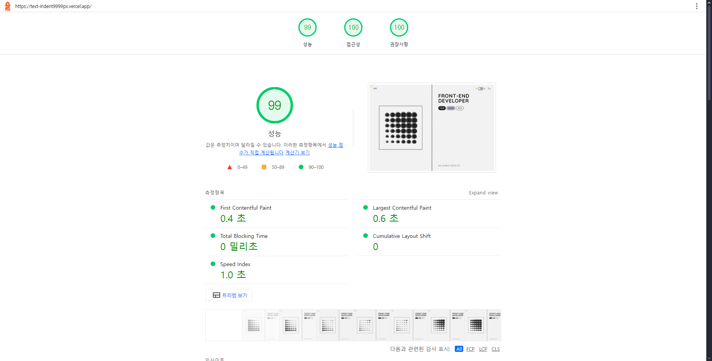

#### 프로필 페이지

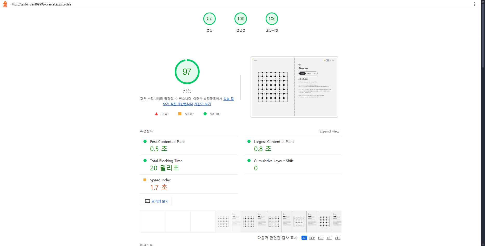

#### 프로젝트 목록 페이지

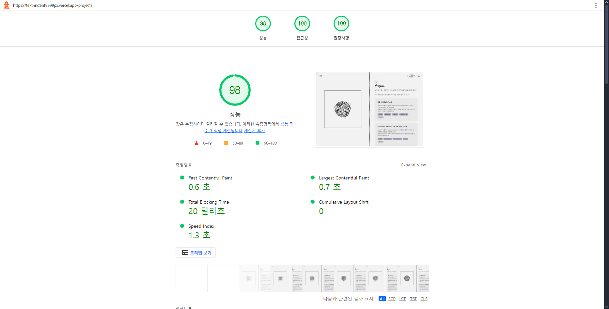

#### 프로젝트 상세 페이지

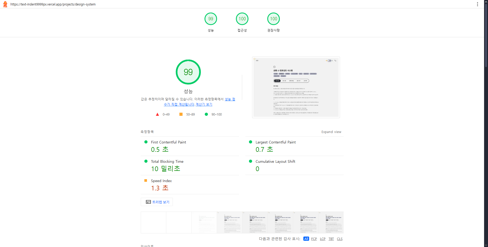

#### 연락처 페이지

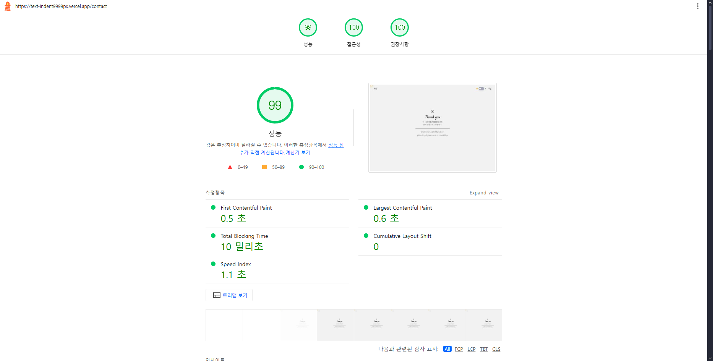

## ♿ 접근성

### 구현된 접근성 기능

1. **키보드 네비게이션**

   - 모든 인터랙티브 요소에 키보드 포커스 지원
   - Tab 순서 최적화
   - `aria-label` 및 `aria-describedby` 속성 활용
   - `focus-visible` 스타일을 통한 명확한 포커스 표시

2. **스크린 리더 지원**

   - 의미론적 HTML 요소 사용 (`<main>`, `<nav>`, `<section>` 등)
   - ARIA 속성을 통한 상태 및 역할 명시
   - `sr-only` 클래스를 통한 스크린 리더 전용 콘텐츠
   - 이미지 및 비디오에 적절한 `alt` 및 `aria-label` 제공

3. **색상 대비**

   - WCAG AA 기준 준수 (4.5:1 이상)
   - 다크모드에서도 충분한 대비 확보
   - 모든 텍스트와 배경 간 대비 비율 검증

4. **Storybook a11y Addon**

   - 컴포넌트 단위 접근성 자동 검사
   - 접근성 문제 실시간 피드백

5. **모달 및 오버레이 접근성**
   - ESC 키로 모달 닫기 지원
   - 포커스 트랩 구현
   - 배경 클릭으로 닫기 옵션 제공
   - 키보드 네비게이션 완전 지원

### 접근성 체크리스트

다음 접근성 항목들이 모두 구현되어 있습니다:

- ✅ 키보드 네비게이션 지원
- ✅ 스크린 리더 호환성
- ✅ 색상 대비 준수 (WCAG AA 기준)
- ✅ ARIA 속성 활용
- ✅ 포커스 표시 명확성
- ✅ Lighthouse 접근성 점수 100점 달성 (모든 페이지)

## 👨‍💻 개발 가이드

### 코드 스타일

이 프로젝트는 다음 도구를 사용하여 코드 스타일을 유지합니다:

- **ESLint**: JavaScript/TypeScript 코드 품질 관리
- **Stylelint**: CSS/SCSS 스타일 품질 관리
- **Prettier**: 코드 포맷팅 (`.prettierrc` 설정 파일 사용)

### 커밋 메시지 컨벤션

커밋 메시지는 다음과 같은 형식을 따릅니다:

```
<type>: <subject>

<body> (선택사항)

<footer> (선택사항)
```

**Type 예시**:

- `feat`: 새로운 기능
- `fix`: 버그 수정
- `docs`: 문서 수정
- `style`: 코드 포맷팅
- `refactor`: 코드 리팩토링
- `test`: 테스트 추가/수정
- `chore`: 빌드 프로세스 또는 보조 도구 변경

### 브랜치 전략

- `main`: 프로덕션 배포용 브랜치
- `develop`: 개발 브랜치
- `feature/*`: 기능 개발 브랜치
- `fix/*`: 버그 수정 브랜치

### 컴포넌트 개발 가이드

1. **새 UI 컴포넌트 생성 시**:

   - `src/components/ui/[ComponentName]/` 폴더 생성
   - TypeScript 타입 정의 (`*.types.ts`)
   - Storybook 스토리 파일 (`*.stories.tsx`) 필수
   - `index.ts`를 통한 export

2. **컴포넌트 구조**:
   ```
   ComponentName/
   ├── ComponentName.tsx      # 메인 컴포넌트
   ├── ComponentName.types.ts # 타입 정의
   ├── ComponentName.config.ts # 설정 (선택)
   ├── ComponentName.stories.tsx # Storybook 스토리
   └── index.ts               # Export
   ```

## 🔧 트러블슈팅

### 일반적인 문제

#### 1. 빌드 에러: "Module not found"

```bash
# node_modules 삭제 후 재설치
rm -rf node_modules package-lock.json
npm install
```

#### 2. TypeScript 타입 에러

```bash
# TypeScript 서버 재시작 (VS Code)
# Cmd/Ctrl + Shift + P → "TypeScript: Restart TS Server"
```

#### 3. 스타일이 적용되지 않음

- Tailwind CSS 클래스가 적용되지 않는 경우:
  - `tailwind.config.js`의 `content` 경로 확인
  - 개발 서버 재시작

#### 4. Storybook 에러

```bash
# Storybook 캐시 삭제
rm -rf .storybook-static node_modules/.cache
npm run storybook
```

#### 5. 환경 변수가 적용되지 않음

- `.env.local` 파일이 프로젝트 루트에 있는지 확인
- `NEXT_PUBLIC_` 접두사 확인
- 개발 서버 재시작

### 의존성 충돌

```bash
# 의존성 충돌 해결
npm install --legacy-peer-deps
```

## 🏗 아키텍처 결정

### 기술 스택 선택 이유

1. **Next.js 15 (App Router)**

   - 서버 컴포넌트를 통한 성능 최적화
   - 파일 기반 라우팅의 직관성
   - 자동 코드 스플리팅

2. **Tailwind CSS 4**

   - 유틸리티 퍼스트 접근법으로 빠른 개발
   - 사용하지 않는 CSS 자동 제거
   - 디자인 시스템과의 통합 용이성

3. **Storybook**

   - 컴포넌트 단위 개발 및 테스트
   - 디자이너-개발자 협업 용이
   - 컴포넌트 문서화 자동화

4. **TypeScript**

   - 타입 안정성을 통한 런타임 에러 방지
   - IDE 자동완성 및 리팩토링 지원
   - 코드 가독성 향상

5. **Compound 패턴 (Card 컴포넌트)**
   - 컴포넌트 조합의 유연성
   - Props drilling 최소화
   - 재사용성 극대화

### 디자인 시스템 구조

- **CSS Custom Properties**: 테마 전환 시 성능 최적화
- **디자인 토큰**: 중앙 집중식 디자인 값 관리
- **Tailwind + SCSS Modules**: 유틸리티와 모듈화의 조화

## 📸 스크린샷

### 반응형 디자인

프로젝트는 다양한 디바이스 크기에서 최적화된 경험을 제공합니다:

#### 데스크톱

- **라이트 모드**: 
- **다크 모드**: 

#### 태블릿

- **라이트 모드**: 
- **다크 모드**: 

#### 모바일

- **라이트 모드**: 
- **다크 모드**: 

#### Storybook

- **다크 모드**: 

### Lighthouse 접근성 점수

모든 페이지에서 **접근성 점수 100점**을 달성했습니다. 상세 점수는 위의 "성능 최적화" 섹션에서 전체 Lighthouse 리포트를 확인할 수 있습니다.

## 📝 라이선스

이 프로젝트는 개인 포트폴리오용으로 제작되었습니다.

## 👤 작성자

- GitHub: [https://github.com/text-indent9999px](https://github.com/text-indent9999px)

---

**마지막 업데이트**: 2026.04.27
